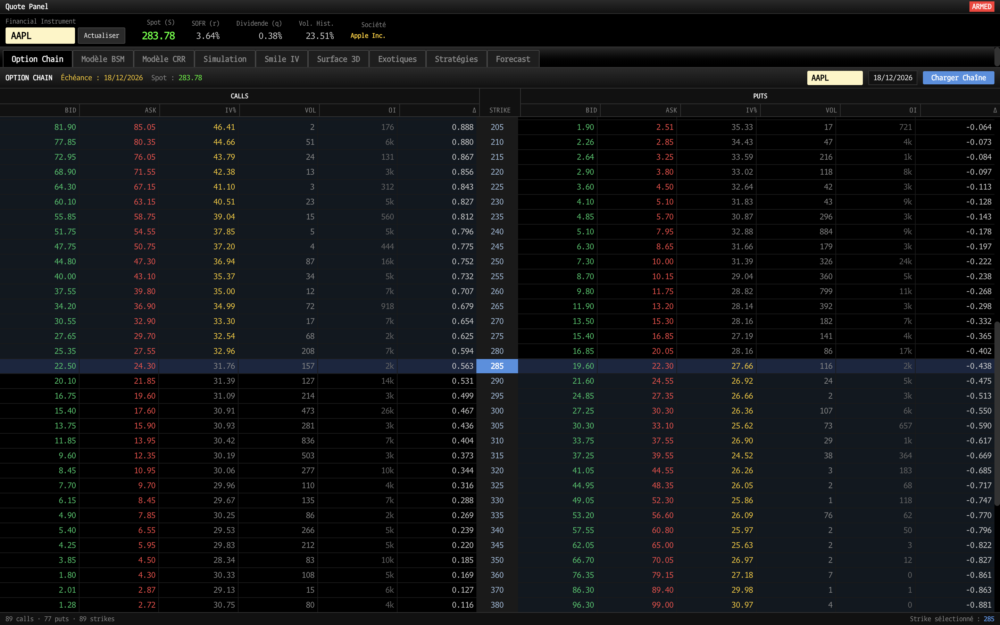
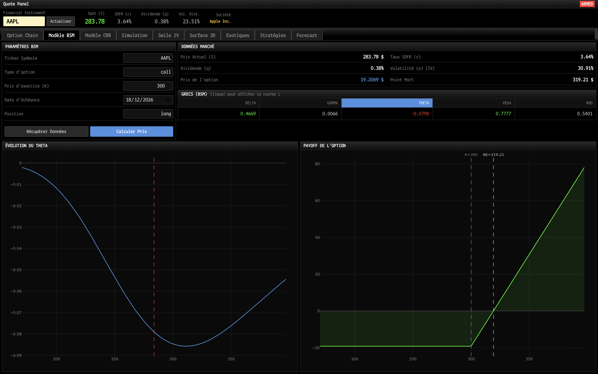
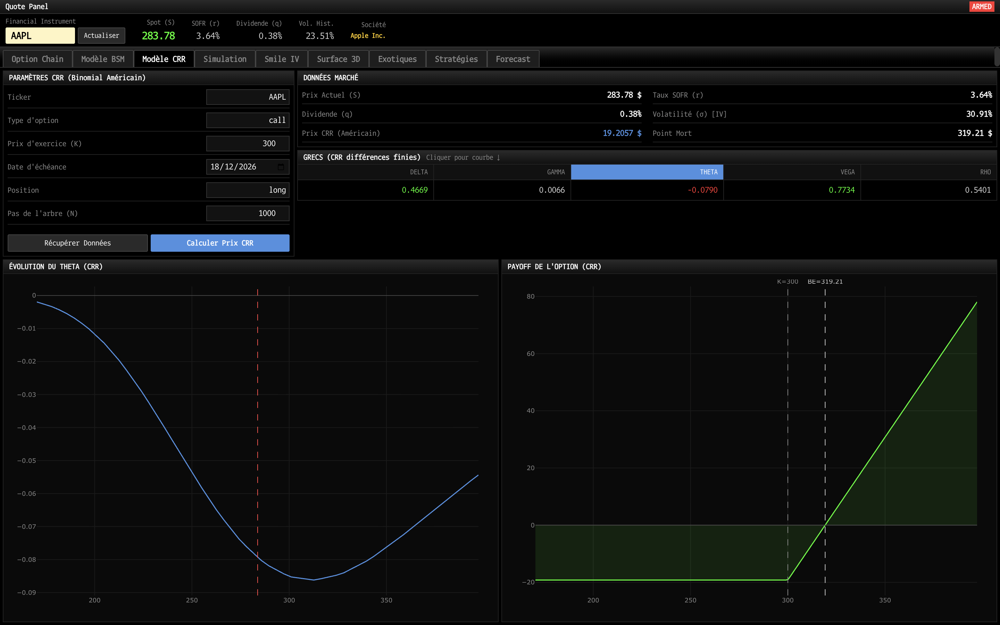
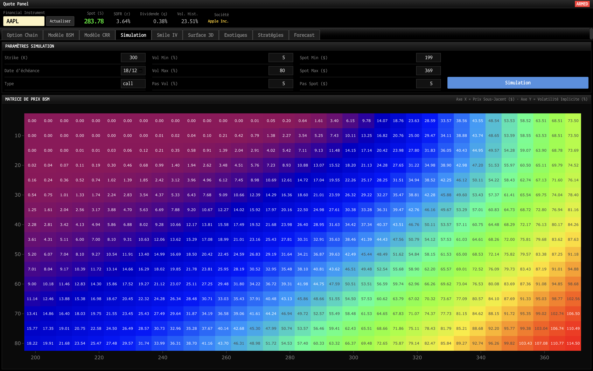
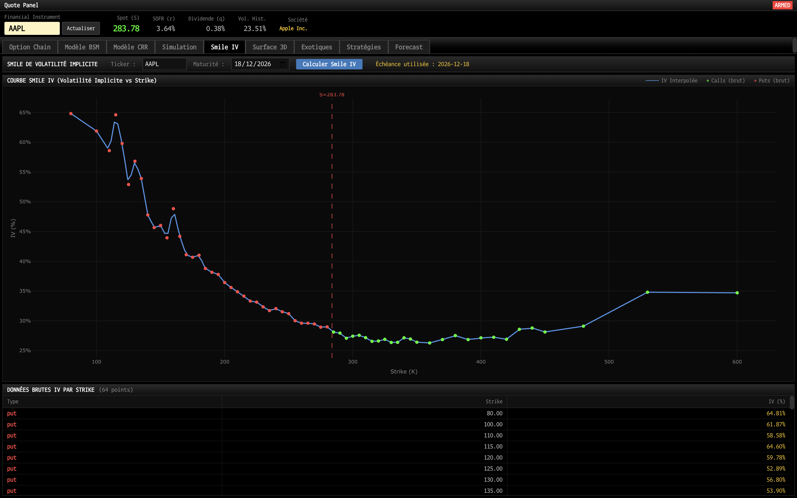
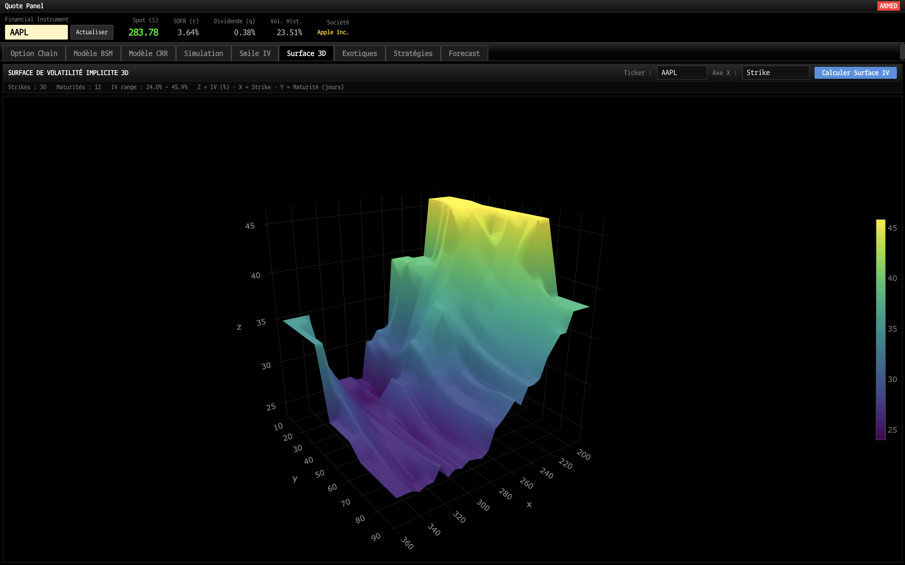
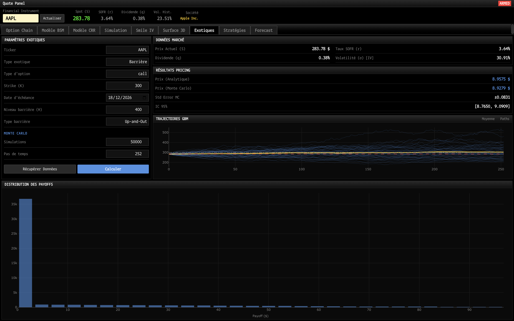
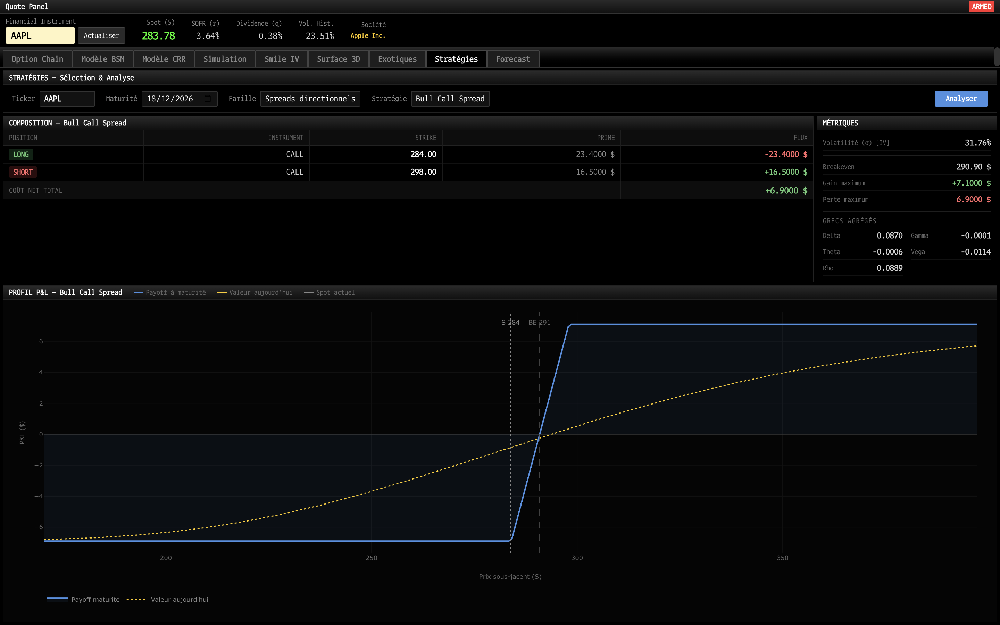
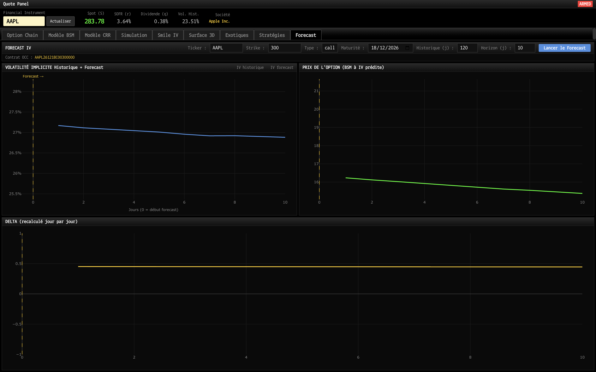

<h1 align="center">
  
  Option Pricer
</h1>

<p align="center">
  <a href="https://www.python.org/downloads/"></a>
  <a href="https://opensource.org/licenses/MIT"></a>
  
  <br>
  
  
  
  
  <br>
  
  
  
  
</p>

<p align="center">
  Application de pricing d'options financières vanilles et exotiques.<br>
  Interface React avec backend Python, données de marché en temps réel.
</p>

---

## Fonctionnalités

### Modèles de pricing

| Modèle                                            |            Type            |
| :------------------------------------------------- | :------------------------: |
| **Black-Scholes-Merton**                     |        Européenne        |
| **Cox-Ross-Rubinstein**                      |        Américaine        |
| **Rubinstein & Reiner (1991) + Monte Carlo** |         Barrières         |
| **Monte Carlo**                              |         Asiatique         |
| **Monte Carlo**                              |          Lookback          |
| **BSM fermée + Monte Carlo**                | Digitale / Cash-or-Nothing |

### Données de marché en temps réel

- **Prix spot** via Yahoo Finance (`yfinance`)
- **Taux sans risque SOFR** depuis l'API FRED
- **Dividendes** et **volatilité implicite** extraits automatiquement depuis les chaînes d'options
- **Historique prix options** via l'API marketdata.app (utilisé pour le forecast IV)
- Cache TTL thread-safe pour limiter les appels API

### Grecs

Delta (Δ), Gamma (Γ), Theta (Θ/jour), Vega (ν), Rho (ρ), calculés analytiquement (BSM) ou par différences finies (CRR)

---

## Interface 9 onglets

### 1 · Option Chain

Carnet d'options en temps réel : strikes, bid/ask, IV implicite, volume, open interest et delta BSM pour calls et puts. Sélection de l'expiry parmi toutes les échéances disponibles.



---

### 2 · Calculateur BSM

Pricing européen en temps réel avec récupération automatique de S, r, q et IV marché.



---

### 3 · Modèle CRR

Pricing américain par arbre binomial. Comparaison directe avec le prix BSM européen.



---

### 4 · Simulation

Heatmap croisée volatilité × prix sous-jacent visualise l'impact combiné de Gamma et Vega sur le prix de l'option.



---

### 5 · Smile de volatilité

Tracé IV vs Strike par inversion numérique de BSM (méthode de Brent) sur les prix mid Calls/Puts OTM.



---

### 6 · Surface IV 3D

Surface de volatilité implicite interactive axes Strike ou Moneyness × Maturité × IV.



---

### 7 · Options exotiques

Pricing analytique + Monte Carlo pour barrières, asiatiques, lookbacks et digitales. Trajectoires GBM simulées, distribution des payoffs et profil à maturité.



---

### 8 · Stratégies

Construction et analyse de stratégies options multi-legs avec données de marché en temps réel.

**22 stratégies disponibles en 5 familles**

- Positions de base : Long/Short Call, Long/Short Put
- Spreads directionnels : Bull/Bear Call Spread, Bull/Bear Put Spread
- Volatilité : Long/Short Straddle, Long/Short Strangle
- Butterflies : Call/Put/Iron Butterfly (long et short)
- Condors : Call/Put/Iron Condor (long et short)

**Métriques calculées automatiquement** : coût total, breakevens, gain maximum, perte maximum et grecs agrégés BSM (Δ, Γ, Θ, ν, ρ) de tous les legs.



---

### 9 · Forecast IV TimesFM (IA)

Prévision de la **volatilité implicite (IV)** via le modèle de fondation **Google TimesFM (2.5-200M)**.
Historique d'IV recalculé par inversion BSM (Brent) à partir des prix d'options fournis par l'API **marketdata.app**.
Repricing BSM et recalcul du delta jour par jour sur l'horizon de forecast (jusqu'à 63 jours) en injectant l'IV prédite.



---

## Architecture

### React ↔ Python via Eel

L'application repose sur **[Eel](https://github.com/python-eel/Eel)** comme pont entre le frontend React et le backend Python.

```
┌─────────────────────────────────────────────────┐
│                 Frontend React                  │
│   TypeScript · Vite · Tailwind · Plotly.js      │
│   9 onglets · MarketContext partagé             │
└────────────────────┬────────────────────────────┘
                     │  window.eel.*()
┌────────────────────▼────────────────────────────┐
│                  api.py (Eel)                   │
│   @eel.expose : pont Python ↔ React             │
└──┬──────────┬──────────────┬────────────────┬───┘
   │          │              │                │
   ▼          ▼              ▼                ▼
logic/    data_fetcher    cache.py    market_data_store
(pricing)  (yfinance                      (Pub/Sub)
           FRED API)
```

---

## Benchmark vs DerivaGem (John Hull)


---

## Installation

### Prérequis

- Python 3.8+
- Node.js 18+ (pour compiler le frontend)
- Google Chrome (Eel ouvre l'application dans Chrome)
- Clé API FRED gratuite → https://fred.stlouisfed.org/docs/api/api_key.html

### Étapes

```Shell
# 1. Cloner le dépôt
git clone -b react-migration https://github.com/nono271105/option-pricer.git
cd option-pricer

# 2. Environnement virtuel Python
python -m venv venv
source venv/bin/activate        # macOS / Linux
venv\Scripts\activate           # Windows

# 3. Dépendances Python
pip install -r requirements.txt

# 4. Variables d'environnement (créer un fichier .env à la racine)
FRED_API_KEY=VOTRE-CLÉ                  # API FRED pour le taux SOFR
MARKET_DATA_TOKEN=VOTRE-TOKEN           # API marketdata.app pour l'IV historique

# 5. Compiler le frontend
cd frontend
npm install
npm run build
cd ..

# 6. Lancement
python main.py
```

### Mode développement (hot-reload)

```bash
# Terminal 1 : serveur Vite
cd frontend && npm run dev

# Terminal 2 : backend Eel
OPTION_DEV=1 python main.py
```

---

## Structure du projet

```
option_pricer/
├── main.py                           # Point d'entrée Eel
├── api.py                            # Pont Eel : toutes les fonctions @eel.expose
├── market_data_store.py              # Store pub/sub centralisé
├── data_fetcher.py                   # yfinance + FRED API
├── cache.py                          # Cache TTL thread-safe
│
├── logic/                            # Modules de logique métier (calculs purs)
│   ├── bsm_logic.py                  # Modèle Black-Scholes + Grecs
│   ├── crr_logic.py                  # Modèle Cox-Ross-Rubinstein + Grecs
│   ├── exotic_options_logic.py       # Barrières, Asiatiques, Lookback, Digitales
│   ├── forecast_logic.py             # Moteur TimesFM
│   ├── simulation_logic.py           # Calcul heatmap
│   ├── strategy_logic.py             # Moteur de calcul des 22 stratégies
│   ├── volatility_smile_logic.py     # Calcul IV smile
│   └── volatility_surface_logic.py   # Surface IV 3D
│
├── frontend/                         # Interface React/TypeScript
│   ├── src/
│   │   ├── app/
│   │   │   ├── App.tsx               # Composant racine + MarketContext
│   │   │   └── components/
│   │   │       ├── OptionChainTab.tsx   # Carnet d'options en temps réel
│   │   │       ├── BsmTab.tsx           # Calculateur BSM
│   │   │       ├── CrrTab.tsx           # Modèle CRR
│   │   │       ├── SimulationTab.tsx    # Heatmap simulation
│   │   │       ├── SmileTab.tsx         # Smile de volatilité
│   │   │       ├── SurfaceTab.tsx       # Surface IV 3D
│   │   │       ├── ExoticsTab.tsx       # Options exotiques
│   │   │       ├── StrategiesTab.tsx    # Stratégies multi-legs
│   │   │       └── ForecastTab.tsx      # Forecast IV TimesFM
│   │   └── styles/
│   ├── package.json
│   └── vite.config.ts
│
├── tests/                            # Tests de régression
│   ├── conftest.py                   # Fixtures pytest
│   ├── test_app.py                   # Tests interface / store
│   ├── test_data.py                  # Tests données (FRED, yfinance)
│   └── test_pricing.py               # Régression BSM, CRR, Grecs, exotiques
│
├── requirements.txt
└── README.md
```

---

## Dépendances principales

### Backend Python

| Package                     | Usage                                     |
| --------------------------- | ----------------------------------------- |
| `eel`                     | Pont Python ↔ React (WebSocket)          |
| `yfinance`                | Prix spot, IV, chaînes d'options         |
| `marketdata.app` (API)    | Historique prix options (IV forecast)     |
| `scipy`                   | CDF normale, interpolation, optimisation  |
| `numpy`                   | Calcul numérique                         |
| `pandas`                  | Manipulation de données                  |
| `requests`                | API FRED                                  |
| `python-dotenv`           | Variables d'environnement                 |
| `pytest` / `pytest-cov` | Tests de régression                      |
| `timesfm` / `torch`     | Modèle de prévision IA (Google TimesFM) |

### Frontend React

| Package                             | Usage                             |
| ----------------------------------- | --------------------------------- |
| `react` 18 + `typescript`       | Interface utilisateur             |
| `vite` 6                          | Build et dev server               |
| `tailwindcss` 4                   | Styles utilitaires                |
| `plotly.js` / `react-plotly.js` | Graphiques interactifs            |
| `@radix-ui/*`                     | Composants UI accessibles         |
| `lucide-react`                    | Icônes                           |
| `motion`                          | Animations                        |
| `react-dnd`                       | Drag & drop (legs de stratégies) |

---

## Licence

MIT : voir [`LICENSE`](LICENSE).

---

*Dernière mise à jour : juin 2026 : migration PySide6 → React/TypeScript + Eel, ajout onglet Option Chain (v3.0)*
